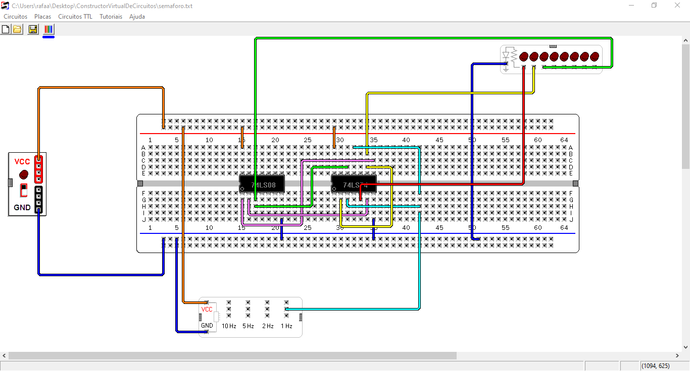

# Sistemas Digitais

## Os trabalhos praticos foram desenvolvidos num software fornecido pelo professor, "Construtor Virtual de Circuitos", e foi o metodo para realizar a montagem dos circuitos dos TP's virtualmente devido à pandemia.

## Construtor Virtual de Circuitos
